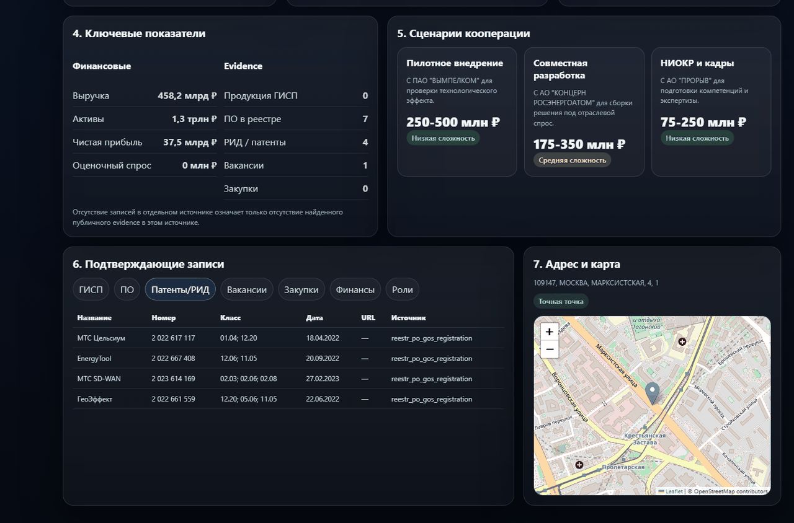
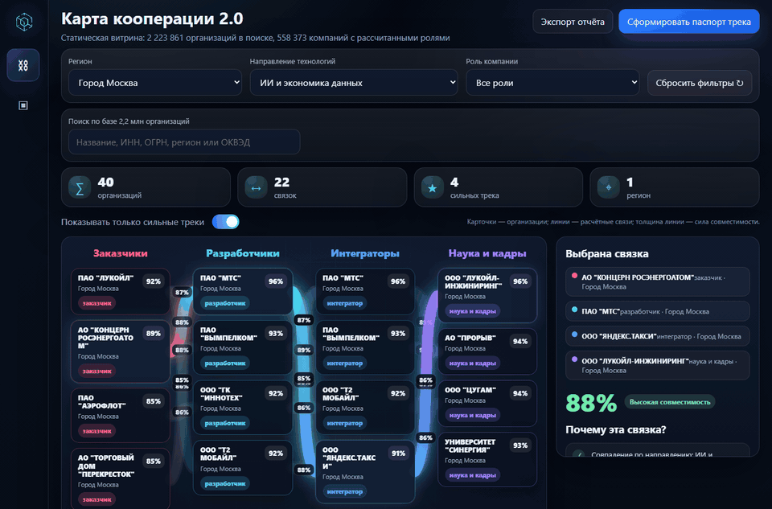
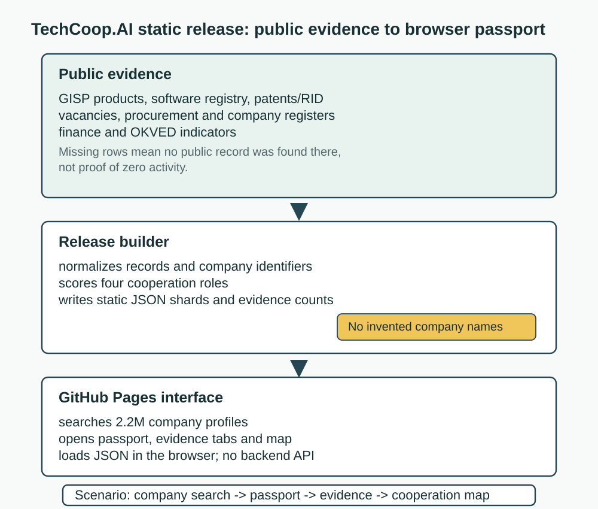
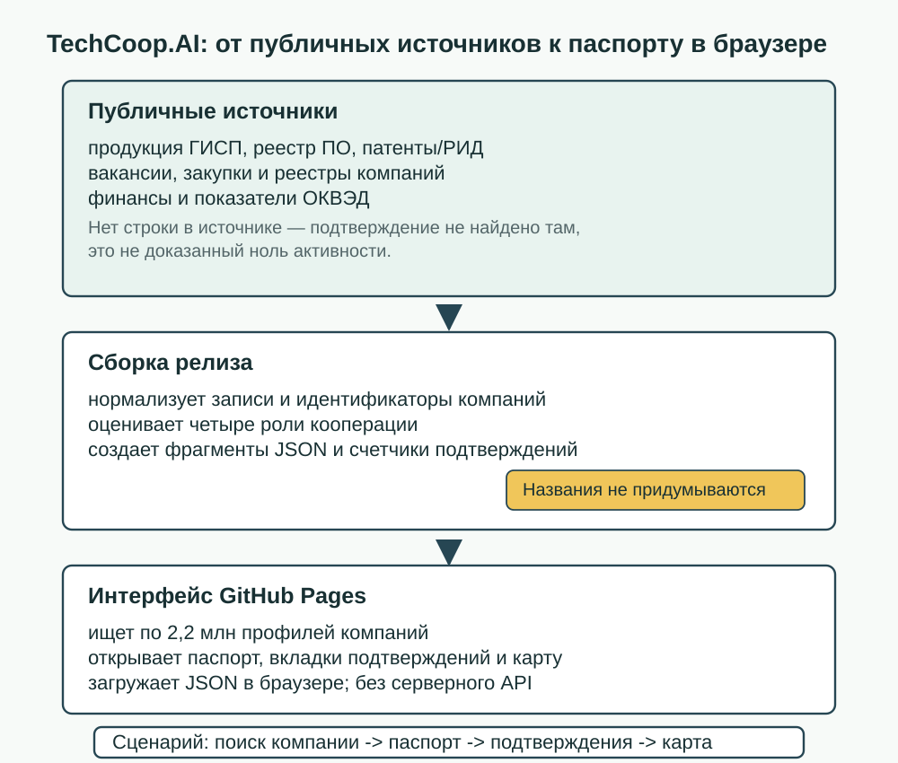

# TechCoop.AI public static release

[English](#english) · [Русский](#русский)

Live site: <https://arseniy24rus.github.io/TechCoop/>



> Interface language note: the shipped public UI is Russian-only. The same real screenshot and GIF are used in both language sections; captions explain the workflow in English and Russian without inventing translated UI.

## English



*The demo uses the live Russian interface to search for MTS, open its passport, inspect evidence tabs and end on the loaded cooperation map.*

### What This Repository Contains

TechCoop.AI is a GitHub Pages release of a technology-cooperation explorer. It is not the full backend or research workspace: the published tree is a large static artifact made from HTML, CSS, JavaScript, images and JSON shards. The root dashboard is `index.html`; the v7 application entry points are [`app/techcoop_map_v7.html`](app/techcoop_map_v7.html), [`app/techcoop_passport_v7.html`](app/techcoop_passport_v7.html) and [`app/techcoop_ui_v7.html`](app/techcoop_ui_v7.html). The browser runtime lives in [`assets/techcoop_ui_v7.js`](assets/techcoop_ui_v7.js) and [`assets/techcoop_ui_v7.css`](assets/techcoop_ui_v7.css). The compact first screen is embedded through [`data/techcoop_ui_v7_payload.js`](data/techcoop_ui_v7_payload.js); the larger searchable layer is split under `data/v7_static/**`.

The audience is an analyst, regional technology scout or partnership team that needs to move from a company name to a defensible cooperation hypothesis. A typical session starts in the global search over 2,223,861 public company profiles, opens a company passport, checks whether the company is treated as a developer, integrator, qualified customer or science/cadre center, and then reads the supporting evidence rows before using the map to inspect possible cooperation routes.

### Real Capabilities

The v7 UI can search by company name, INN, OGRN, region and OKVED; render a company passport; show financial indicators where present; display an evidence ladder; list concrete source records for software registry, GISP products, patents/RID, vacancies, procurement and roles; and place a company on a Leaflet/OpenStreetMap panel when coordinates are available. The map view groups organizations by region, technology direction and role, then draws route-like links between compatible organizations. The role drawer paginates large role lists from the static shards instead of requiring a server.

The release numbers are recorded in [`README_UI_V7.md`](README_UI_V7.md) and [`MANIFEST_UI_V7.json`](MANIFEST_UI_V7.json): 2,223,861 base company profiles, 558,373 role-scored companies, 1,896,871 role rows and 8,670 enterprise profiles with resolved names. Evidence detail rows are summarized by source in [`MANIFEST_UI_V7.json`](MANIFEST_UI_V7.json), while provider URLs and source classes are listed in [`MANIFEST_ENTERPRISE.json`](MANIFEST_ENTERPRISE.json). The public static layer is close to the GitHub Pages size limit, which is why the repository is an allowlisted release tree rather than a normal source-and-build checkout.



### Methodology And Guardrails

The project separates company identity from role scoring. The UI must not fabricate a name: if no resolved name exists in the public identity layer, the passport shows `Профиль расчётной базы` with INN/OGRN and a visible missing-name note. A missing source row is also not interpreted as proof of non-existence; the passport states that absence in a source means no public evidence was found in that source. Role labels are therefore cooperation hypotheses from public indicators, not legal qualifications, procurement recommendations or proof of capability.

The static release excludes `.venv`, raw archives, parquet/DuckDB inputs, local logs, previews, tests and original working/QA screenshots. The README media in `assets/visuals/readme/` is intentionally included as documentation. The published UI is designed for GitHub Pages or an ordinary static file server. Opening the HTML directly from the filesystem is not a supported way to exercise lazy-loaded JSON shards.

### Run Locally And Check

```bash
python -m http.server 8000
```

Then open `http://127.0.0.1:8000/app/techcoop_ui_v7.html`.

Existing lightweight syntax check:

```bash
node --check assets/techcoop_ui_v7.js
```

No package install is needed for the static UI. For release QA, use a browser and verify the search-to-passport flow, role drawer pagination, evidence tabs and Leaflet map with the static server URL.

### Licensing And Attribution

No top-level `LICENSE` file is present in this release tree, so the repository does not grant a broad open-source reuse license by itself. Upstream provider terms remain controlling for public evidence sources such as GISP, the Russian software registry, tax/company references, Trudvsem, procurement and patent/RID sources. Leaflet is bundled locally and OpenStreetMap attribution is shown in the map panel. Treat the published data as an attributed demonstration layer, not a redistributable raw data dump.

<details>
<summary>Preserved release notes from the previous README</summary>

- `index.html` is the release executive dashboard.
- `app/techcoop_map_v7.html` is the cooperation map.
- `app/techcoop_passport_v7.html` is the company passport.
- `app/techcoop_ui_v7.html` combines map and passport.
- GitHub Pages is configured to publish from the `main` branch root.
- The public tree contains only the files needed for the static release: HTML entry points, favicon/version files, minimal assets including local Leaflet, `data/techcoop_ui_v7_payload.js` and `data/v7_static/**`.

</details>

## Русский

> Примечание о языке интерфейса: опубликованный интерфейс TechCoop.AI сейчас только на русском. В английском разделе используются те же реальные скриншот и GIF; подписи переводят сценарий, но не изображают несуществующий английский интерфейс.


*Запись показывает реальный русскоязычный интерфейс: поиск ПАО "МТС", паспорт компании, вкладки с подтверждающими записями и загруженную карту кооперации.*

### Что находится в репозитории

TechCoop.AI — это релизная статическая витрина технологической кооперации для GitHub Pages. Это не полная серверная часть и не рабочее хранилище исходных выгрузок: опубликованная ветка состоит из HTML, CSS, JavaScript, изображений и фрагментов JSON. Корневая панель находится в `index.html`; страницы входа v7 — [`app/techcoop_map_v7.html`](app/techcoop_map_v7.html), [`app/techcoop_passport_v7.html`](app/techcoop_passport_v7.html) и [`app/techcoop_ui_v7.html`](app/techcoop_ui_v7.html). Браузерная логика лежит в [`assets/techcoop_ui_v7.js`](assets/techcoop_ui_v7.js), стили — в [`assets/techcoop_ui_v7.css`](assets/techcoop_ui_v7.css). Первый экран использует компактный [`data/techcoop_ui_v7_payload.js`](data/techcoop_ui_v7_payload.js), а полный поиск и паспорта догружают `data/v7_static/**`.

Главный пользователь — аналитик, региональная команда технологического развития или партнерский офис, которому нужно перейти от названия компании к проверяемой гипотезе кооперации. Рабочий сценарий выглядит так: поиск по базе 2 223 861 публичных профилей, открытие паспорта организации, проверка ролей — разработчик, интегратор, квалифицированный заказчик, наука и кадры — чтение подтверждающих записей и переход к карте возможных связок.

### Реальные возможности

Интерфейс v7 ищет по названию, ИНН, ОГРН, региону и ОКВЭД; показывает паспорт компании; выводит финансовые показатели при наличии данных; строит шкалу подтверждений; раскрывает конкретные строки источников по реестру ПО, ГИСП, патентам/РИД, вакансиям, закупкам и ролям; показывает адрес и карту Leaflet/OpenStreetMap, если есть координаты. Карта группирует организации по региону, технологическому направлению и роли, затем рисует связи между совместимыми участниками. Большие списки ролей открываются в выдвижной панели и разбиваются на страницы из статических фрагментов JSON без серверного API.

Числа релиза зафиксированы в [`README_UI_V7.md`](README_UI_V7.md) и [`MANIFEST_UI_V7.json`](MANIFEST_UI_V7.json): 2 223 861 базовый профиль, 558 373 компании с рассчитанными ролями, 1 896 871 строка с ролевыми признаками и 8 670 профилей крупных организаций с установленными названиями. Сводка детальных подтверждающих записей находится в [`MANIFEST_UI_V7.json`](MANIFEST_UI_V7.json), а классы источников и адреса поставщиков данных — в [`MANIFEST_ENTERPRISE.json`](MANIFEST_ENTERPRISE.json). Статический слой близок к лимиту GitHub Pages, поэтому репозиторий устроен как релиз по разрешенному набору файлов, а не как обычный исходный проект со сборкой.



### Методология и ограничения

Проект отделяет слой идентификации компаний от расчета ролей. Интерфейс не придумывает названия компаний: если в публичном слое идентификации нет установленного названия, паспорт показывает `Профиль расчётной базы`, ИНН/ОГРН и явную пометку о недостающем названии. Отсутствие строки в отдельном источнике также не трактуется как доказанный ноль; паспорт прямо говорит, что публичное подтверждение не было найдено именно в этом источнике. Роли являются гипотезами о возможной функции в технологической кооперации, а не юридической квалификацией, рекомендацией к закупке или доказательством компетенции.

Из релиза исключены `.venv`, исходные архивы, входные parquet/DuckDB-файлы, локальные логи, рабочие preview, тесты и исходные рабочие/QA-скриншоты. Документационные изображения и GIF в `assets/visuals/readme/` добавлены намеренно. Сайт нужно открывать через GitHub Pages или обычный статический сервер. Открытие HTML напрямую из файловой системы не является корректным способом проверить догружаемые JSON-фрагменты.

### Локальный запуск и проверки

```bash
python -m http.server 8000
```

Затем открыть `http://127.0.0.1:8000/app/techcoop_ui_v7.html`.

Быстрая существующая проверка синтаксиса:

```bash
node --check assets/techcoop_ui_v7.js
```

Установка пакетов не нужна. Для QA релиза проверяйте в браузере сценарий поиск -> паспорт, постраничный список ролей, вкладки с подтверждающими записями и Leaflet-карту на URL локального статического сервера.

### Лицензии и атрибуция

В корне релиза нет файла `LICENSE`, поэтому сам репозиторий не выдает широкой открытой лицензии на повторное использование кода и данных. Условия исходных поставщиков остаются определяющими для ГИСП, реестра ПО, налоговых и справочных данных о компаниях, Trudvsem, закупок и патентно-РИД источников. Leaflet поставляется локально, а атрибуция OpenStreetMap выводится в панели карты. Данные стоит рассматривать как атрибутированный демонстрационный слой, а не как массив исходных данных для свободного перераспространения.

<details>
<summary>Сохраненные заметки старого README</summary>

- `index.html` — релизная сводная панель.
- `app/techcoop_map_v7.html` — карта кооперации.
- `app/techcoop_passport_v7.html` — паспорт компании.
- `app/techcoop_ui_v7.html` — единая страница с картой и паспортом.
- GitHub Pages публикует ветку `main`, каталог `/`.
- В опубликованную ветку входят только файлы статического релиза: HTML-точки входа, файлы значков и версии, минимальные ресурсы включая локальный Leaflet, `data/techcoop_ui_v7_payload.js` и `data/v7_static/**`.

</details>
